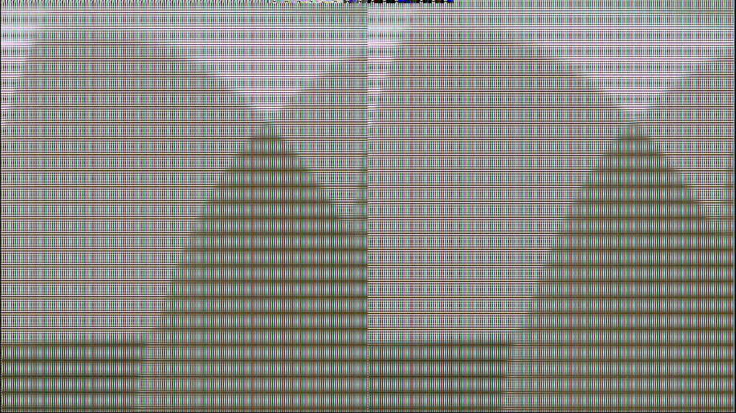

# 🚀 FPGA 기반 노이즈 제거 필터 IP 설계 프로젝트

본 프로젝트는 3x3 윈도우 기반 영상 노이즈 제거 필터를 Verilog로 설계하고,
Zynq 기반 보드에서 실시간 영상 스트리밍 파이프라인을 구현

---

## 🔧 사용 기술 및 툴

- Vivado 2022.2, Verilog HDL
- AXI4-Stream 프로토콜
- Zynq-7000 (Zybo Z7-20)
- ILA, VDMA, FSM, 파이프라인 처리 기법
- Custom HW IP 설계 및 디버깅

---

## 💡 프로젝트 목표

- **실시간 영상 필터링**을 위한 **커스텀 HW IP**를 직접 설계
- AXI4-Stream 프로토콜을 이용해 **VDMA ↔ HW IP ↔ HDMI 출력** 파이프라인 구성
- **FSM과 파이프라인 설계**를 통해 타이밍 정합 및 출력 정합성 확보

---

## 📌 주요 기능 및 설계 개요

- 입력: 1920x1080, 30fps RGB 스트림
- 처리: 3x3 평균 기반 노이즈 제거
- 출력: HDMI (VDMA Read → Video Out)
- 주요 처리 방식:
  - Line Buffer (3줄)
  - Valid & Ready 핸드쉐이크 제어
  - TLAST / TUSER 처리
  - FSM 기반 동기화

---

## ⚙️ 구현 흐름도

[Block Diagram.pdf](https://github.com/user-attachments/files/21471468/Block.Diagram.pdf)

---

## 🧠 개발 중 해결한 문제와 기술적 인사이트

### 📍 문제1: TLAST/TUSER 스트라이프 발생  
- **원인:** 파이프라인 처리 시 TUSER 위치가 frame 시작점과 mismatch  
- **해결:** FSM과 `pixel_x/pixel_y` 카운터, 타이밍 딜레이 파이프라인 적용

### 📍 문제2: VDMA circular mode에서 sync mismatch  
- **원인:** MM2S interrupt 미발생으로 TUSER generation 실패  
- **해결:** MM2S interrupt 기반 FSM 설계 후, 정확한 frame 시작점 맞춤

### 📍 문제3: Verilog 핸드쉐이크 타이밍 위반  
- **원인:** m_axis_tready에 따른 tvalid 제어 미흡  
- **해결:** `(!m_axis_tvalid || m_axis_tready)` 논리 적용으로 AXI4-Stream 준수

> 이러한 문제 해결 과정을 통해 실제 SoC 파이프라인 설계에서 필요한
> **시퀀셜 타이밍, 핸드쉐이크 흐름 제어, FSM 상태관리**에 대한 깊은 이해

---

## 🖼️ 결과 이미지 및 디버깅 사진

> ## 📅 [2025-04-08]  
> **문제:** 영상이 아래로 두 줄 밀려 출력됨
> 
> **해결:** TUSER 위치 FSM 정렬 후 정상 출력
> 
>
> 
> ## 📅 [2025-04-09]  
> **문제:** 영상 프레임이 과도하게 떨리거나 혹은 가로줄&세로줄 발생 증상
> 
> **해결:** TUSER와 TLAST 신호를 AXI HandShake 기준에 맞추지 않고 출력하여 발생한 문제
> 
> 
>
> 
> ## 📅 [2025-05-14]  
> **문제:** RGB 컬러값이 섞인 무의미한 영상 출력
> 
> **해결:** vitis에서 VDMA 초기화시에 HorisizeInput과 Stride를 7680(1920의 4배)로 설정
> 
> 
> 
> 
> ## 📅 [2025-05-19]  
> **문제:** 프레임 내 픽셀이 뭉쳐서 중간중간에 작은 스트라이프 패턴 형
> 
> **해결:** TUSER와 TLAST 신호를 AXI HandShake 기준에 맞추지 않고 출력하여 발생한 문제
> - M_AXIS_TLAST, M_AXIS_TUSER 신호는 적합한 조건일 경우일 때만 출력하도록 적용
> - 결국 VDMA와 DDR Memory를 연결하는 PS의 arbitrator(S_HP)를 추가
>   
>
> 
> ## 📅 [2025-05-25]  
> **문제:** FPGA 보드 내에서 사용 가능한 LUT를 초과한 설계로 인한 합성 불가 오류
> 
> **로그:**  "[DRC UTLZ-1] Resource utilization: LUT as Distributed RAM over-utilized in Top Level Design (This design requires more LUT as Distributed RAM cells than are available in the target device. This design requires 20734 of such cell types but only 17400 compatible sites are available in the target device. Please analyze your synthesis results and constraints to ensure the design is mapped to Xilinx primitives as expected. If so, please consider targeting a larger device. Please set tcl parameter "drc.disableLUTOverUtilError" to 1 to change this error to warning.)"
>
> 
> **해결:** Line Buffer 3줄을 라인별로 명시적 분리방법을 사용
> - 수정 전 : (* ram_style = "block" ) reg [DATA_WIDTH-1:0] line_buffer [0:1920-1]
> - 수정 후 : "(* ram_style = "block" ) reg [DATA_WIDTH-1:0] line0 [0:LINE_WIDTH-1]" x 3개 생성
>
> 
> ## 📅 [2025-07-06]  
> **문제:** 영상에서 가로줄 및 세로줄이 이동 현상 발생
> - s_curr_tvalid를 받지 못한 상태에서 m_axis_tuser가 미리 출력되는 경우
> - denoise ip 앞단이나 뒷단에서 tready & valid가 유효하지 않은 상황에서 tuser를 출력하는 상황
>
> 
> **해결:** TUSER와 TLAST 신호를 AXI HandShake 기준에 맞추지 않고 출력하여 발생한 문제
> - 모든 m_axis_xx 출력 조건에 s_valid와 s_ready를 고려하는 조건을 추가하니 세로줄 생김 및 이동 증상이 사라짐
> - 단, 아직 가로줄 아래로 흐름 현상은 남아 있음
> 
> 
> 
> ## 📅 [2025-07-14]  
> **문제:** Mean Filter(평균 필터)를 구현중에 칼라 노이즈가 오히려 더 증가하는 현상
>
> 
> **해결:** 파악중
> 
>
>
> ## 📅 [2025-08-10]  
> **문제:** 영상에서 가로줄이 아래로 흐르는 이슈 존재
>
> **해결:** pixel_x, pixel_y, m_axis_tuser, m_axis_tlast 생성 조건 중 curr_state를 사용하는 사항 폐기
> - 한 줄 내 픽셀이 채워지지 않거나 한 프레임이 채워지지 않은 상태에서 axi4-stream 신호를 출력함으로써 발생한 문제로 확인됨
>
> 
> ## 📅 [2025-08-11]  
> **문제:** Mean Filter(평균 필터)를 구현중에 칼라 노이즈가 오히려 더 증가하는 현상
>
> **해결:** 픽셀 단위가 아닌 한 픽셀 내 R, G, B 단위(10bit)로 mean filter 적용하도록 수정
>
> 
> (mean_filter off 경우)
> 
>
> 
> (mean_filter on 경우)
> 
>
> 

---

## 📁 자료

- [`src/`](src): Verilog 소스
- [`docs/`](docs): 문제 해결 과정 문서 + 사진
- [`project_archive/`](project_archive): 날짜별 Vivado 프로젝트 ZIP

---

## ✍️ 한마디

해당 프로젝트는 단순한 RTL 설계를 넘어서,  
**"시스템 전체를 설계하고 디버깅하며 구조적 사고와 문제 해결 능력"**을 길렀던 경험

---

## 📌 GitHub Pages 문서 바로가기

👉 [프로젝트 정리 웹페이지 보기](https://username.github.io/denoise_fpga_project)

